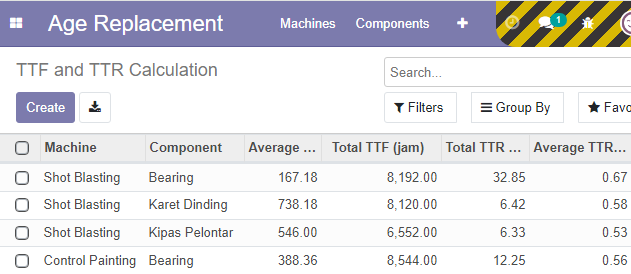
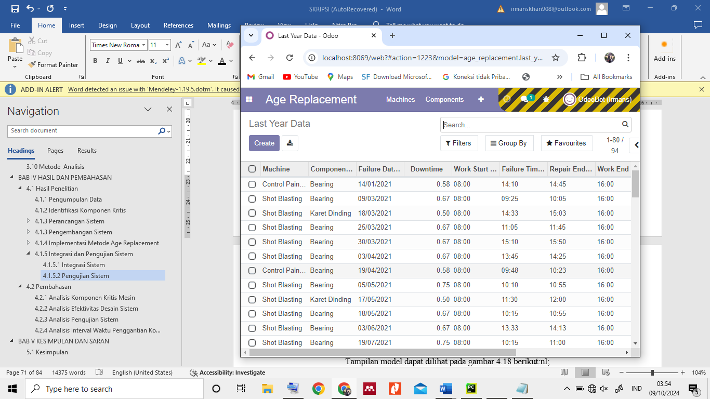
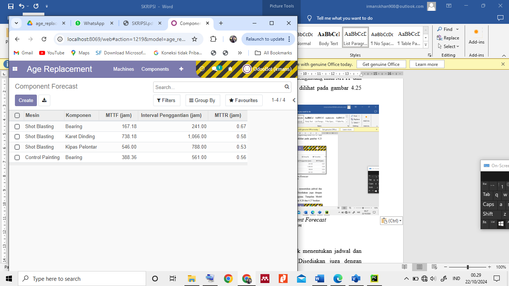

# 🚀 Odoo Maintenance - Age Replacement Method

## 📌 Deskripsi Proyek

Proyek ini adalah implementasi **penjadwalan preventive maintenance** menggunakan **metode Age Replacement** di **ERP Odoo**.  
Modul ini dirancang untuk membantu dalam **mengelola jadwal penggantian komponen mesin** berdasarkan data historis kegagalan.

## ✅ Fitur Utama

- 📊 **Manajemen Mesin & Komponen**: Input dan pemantauan data mesin & komponen.
- 🔢 **Perhitungan TTF & TTR**: Menghitung *Time to Failure (TTF)* dan *Time to Repair (TTR)*.
- 📉 **Estimasi MTTF & MTTR**: Prediksi interval penggantian komponen berdasarkan metode Age Replacement.
- 📈 **Dashboard & Laporan**: Visualisasi analisis maintenance.
- 🔔 **Notifikasi Penggantian**: Pengingat otomatis jika waktu penggantian sudah mendekati.

## ⚙️ Cara Kerja Modul

1. **Input Data** → Pengguna memasukkan data mesin & komponen.
2. **Perhitungan TTF & MTTR** → Sistem menghitung waktu antar kegagalan dan waktu perbaikan.
3. **Analisis Preventive Maintenance** → Menggunakan metode Age Replacement untuk menentukan interval penggantian optimal.
4. **Laporan & Dashboard** → Menampilkan hasil analisis dalam bentuk grafik & tabel.

## 📸 Screenshot Tampilan

Berikut adalah beberapa tampilan dari sistem:

### **1️⃣ Form Input Komponen & Mesin**
📌 Menunjukkan bagaimana data mesin dan komponen dikelola dalam sistem.  

### **2️⃣ Perhitungan TTF & TTR**
📌 Inti dari metode Age Replacement, di mana sistem menghitung *Time to Failure* dan *Time to Repair*.  

### **3️⃣ History Kerusakan & Frekuensi Kegagalan**
📌 Data historis kegagalan yang digunakan sebagai dasar analisis maintenance.  

### **4️⃣ Prediksi Pergantian Komponen**
📌 Sistem menentukan interval penggantian optimal berdasarkan metode Age Replacement.  

## 🛠️ Teknologi yang Digunakan

- **Odoo ERP** (Python, XML)
- **PostgreSQL** (Database Management)
- **ORM Odoo** (Object-Relational Mapping)
- **Analisis Data** (MTTF, MTTR, Reliability Function)

## 📜 Lisensi
Proyek ini dikembangkan untuk keperluan akademik dan pengembangan lebih lanjut.  
Lisensi: 

## 📩 Kontak

📧 Email: irmanskhan785@gmail.com
